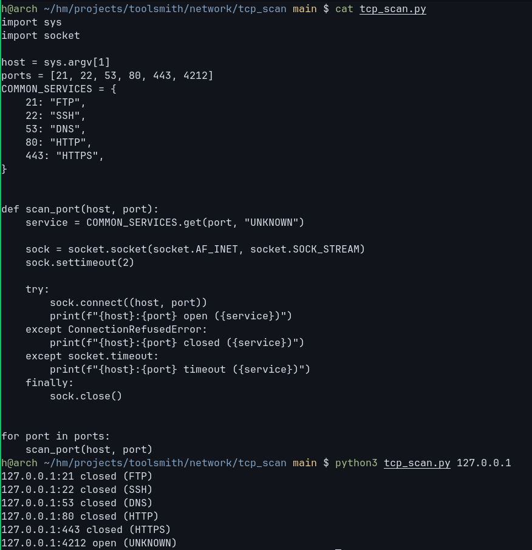

# Service Guessing from Port Numbers

## Session Goal

Learn the difference between:

```text
Observed Fact
```

and

```text
Assumption
```

when interpreting scan results.

Extend the scanner from:

```text
Port Discovery
```

to:

```text
Common Service Guessing
```

---

## What We Built

Current scanner:

```text
Host
↓
Port List
↓
Loop
↓
TCP Connect
↓
Open / Closed
```

Example:

```text
127.0.0.1:4212 open
```

---

## Key Observation

The scanner only proves:

```text
TCP connection succeeded
```

It does NOT prove:

```text
SSH
HTTP
HTTPS
FTP
DNS
```

---

## Port Numbers as Hints

Common conventions:

```text
21  → FTP
22  → SSH
53  → DNS
80  → HTTP
443 → HTTPS
```

These are widely used.

However:

```text
Common
≠
Guaranteed
```

---

## Mental Model

Wrong:

```text
22 open
↓
SSH
```

Correct:

```text
22 open
↓
Probably SSH
```

---

## Why?

Example:

```bash
python3 -m http.server 22
```

Now:

```text
22 open
```

But the service is:

```text
HTTP
```

not:

```text
SSH
```

Port numbers can be changed.

Services can run anywhere.

---

## Service Guessing

We added:

```python
COMMON_SERVICES = {
    21: "FTP",
    22: "SSH",
    53: "DNS",
    80: "HTTP",
    443: "HTTPS",
}
```

Lookup:

```python
service = COMMON_SERVICES.get(port, "UNKNOWN")
```

---

## Dictionary Lookup

Example:

```python
COMMON_SERVICES.get(22, "UNKNOWN")
```

Result:

```text
SSH
```

Example:

```python
COMMON_SERVICES.get(4212, "UNKNOWN")
```

Result:

```text
UNKNOWN
```

---

## Current Output

Example:

```text
127.0.0.1:21 closed (FTP)
127.0.0.1:22 closed (SSH)
127.0.0.1:53 closed (DNS)
127.0.0.1:80 closed (HTTP)
127.0.0.1:443 closed (HTTPS)
127.0.0.1:4212 open (UNKNOWN)
```

---

## Important Distinction

This output means:

```text
21 is commonly used by FTP

22 is commonly used by SSH

80 is commonly used by HTTP
```

It does NOT mean:

```text
FTP confirmed
SSH confirmed
HTTP confirmed
```

---

## Security Mindset

Port scanning answers:

```text
Can I connect?
```

Service identification answers:

```text
What actually responded?
```

These are different questions.

---

## Looking Ahead

Current:

```text
22 open
↓
SSH? (guess)
```

Next session:

```text
Connect
↓
Receive Data
↓
Observe Banner
↓
Identify Service
```

Example:

```text
SSH-2.0-OpenSSH_9.9
```

or:

```text
HTTP/1.1 200 OK
```

These are much stronger indicators than port numbers alone.

---

## Final Mental Model

```text
Port Number
↓
Common Service Guess
↓
Hypothesis

Banner
↓
Actual Protocol Response
↓
Evidence
```

---

# Observation



---

## QA

**Q1.**

What does an open port actually prove?

<details>
<summary><strong>A1.</strong></summary>

</details>

---

**Q2.**

Why is "22 open = SSH" not always correct?

<details>
<summary><strong>A2.</strong></summary>

</details>

---

**Q3.**

What is the purpose of the `COMMON_SERVICES` dictionary?

<details>
<summary><strong>A3.</strong></summary>

</details>

---

**Q4.**

What does `.get(port, "UNKNOWN")` do?

<details>
<summary><strong>A4.</strong></summary>

</details>

---

**Q5.**

What will this return?

```python
COMMON_SERVICES.get(443, "UNKNOWN")
```

<details>
<summary><strong>A5.</strong></summary>

</details>

---

**Q6.**

What will this return?

```python
COMMON_SERVICES.get(4212, "UNKNOWN")
```

<details>
<summary><strong>A6.</strong></summary>

</details>

---

**Q7.**

What is the difference between service guessing and service identification?

<details>
<summary><strong>A7.</strong></summary>

</details>

---

**Q8.**

Which provides stronger evidence: a port number or a banner?

<details>
<summary><strong>A8.</strong></summary>

</details>

---

**Q9.**

Complete:

```text
Port Number
↓
_______________
↓
Hypothesis
```

<details>
<summary><strong>A9.</strong></summary>

</details>

---

**Q10.**

Complete:

```text
Banner
↓
_______________
↓
Evidence
```

<details>
<summary><strong>A10.</strong></summary>

</details>
