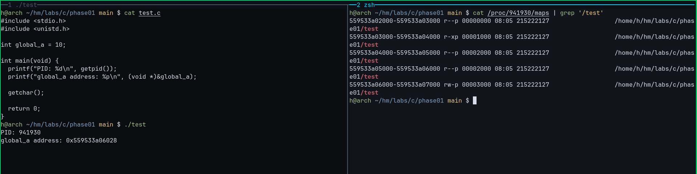
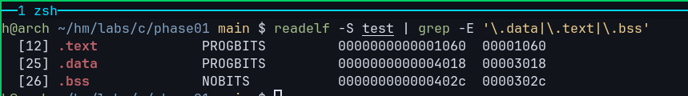
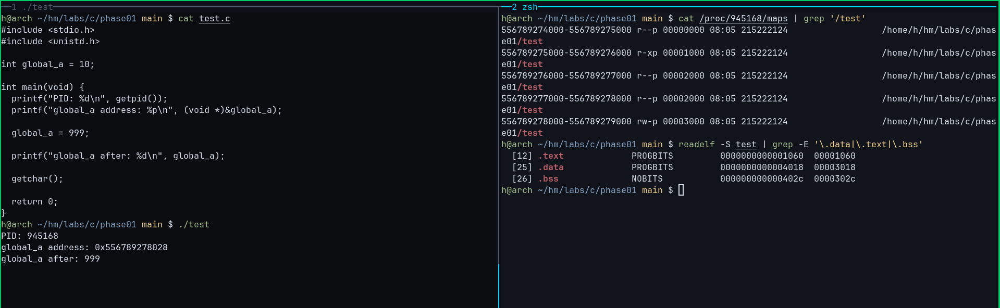

# Data Segment Observation

## Session Goal

Observe where initialized global variables live in memory.

By the end of this session, you should be able to explain:

- What the Data Segment contains
- Why initialized global variables belong to the Data Segment
- How Data Segment memory appears in `/proc/<PID>/maps`
- How `.data` in an ELF file relates to the Data Segment
- Why the Data Segment is writable

---

# Review

Previous sessions:

```text
Code Segment
=
Executable Machine Instructions

CPU
↓
Fetch
↓
Execute
```

We observed:

```text
.text
```

inside the ELF file and:

```text
r-xp
```

inside process memory.

---

# Core Question

Consider:

```c
int global_a = 10;
```

Question:

```text
Where does this variable live while the program is running?
```

---

# Prediction

Variable:

```c
int global_a = 10;
```

Properties:

```text
Global Variable
Initialized
```

Question:

```text
Which memory region should contain it?

Code
Data
BSS
Heap
Stack
```

---

# Observation Exercise

Create:

```c
#include <stdio.h>
#include <unistd.h>

int global_a = 10;

int main(void)
{
    printf("PID: %d\n", getpid());
    printf("global_a address: %p\n", (void *)&global_a);

    getchar();

    return 0;
}
```

Compile:

```bash
gcc -o data_demo data_demo.c
```

Run:

```bash
./data_demo
```

Keep the process running.

---

# Observation 1

Inspect process memory:

```bash
cat /proc/<PID>/maps | grep '/data_demo'
```

Observe the mappings.

Question:

```text
Which mapping contains the address of global_a?
```

---

# Observation 2

Compare:

```text
global_a address
```

with:

```text
mapping start
mapping end
```

Question:

```text
Does global_a fall inside an rw-p region?
```

---

# Observation 3

Inspect ELF sections:

```bash
readelf -S data_demo | grep -E '\.data|\.text|\.bss'
```

Example:

```text
.text
.data
.bss
```

Question:

```text
Can you find the .data section?
```

---

# Important Observation

Initialized global variables already have values:

```c
int global_a = 10;
```

Linux must preserve:

```text
10
```

before execution begins.

Therefore:

```text
global_a
```

must be stored inside:

```text
.data
```

inside the executable.

---

# Data Segment vs Stack

Compare:

```c
int global_a = 10;
```

and

```c
int local_x = 10;
```

Difference:

```text
global_a
=
Exists for the entire lifetime of the process

local_x
=
Exists only during a function call
```

Therefore:

```text
global_a
→ Data Segment

local_x
→ Stack
```

---

# Observation 4

Modify the program:

```c
#include <stdio.h>
#include <unistd.h>

int global_a = 10;

int main(void)
{
    printf("PID: %d\n", getpid());

    printf("global_a before: %d\n", global_a);

    global_a = 999;

    printf("global_a after : %d\n", global_a);

    getchar();

    return 0;
}
```

Question:

```text
Why does this work?
```

Observe:

```text
global_a after : 999
```

---

# Why Data Segment Is Writable

Code Segment:

```text
r-xp
```

Data Segment:

```text
rw-p
```

Reason:

```text
Code
=
Instructions
=
Execute

Data
=
Variables
=
Read + Write
```

Programs must be able to modify variable values during execution.

---

# ELF Relationship

```text
ELF File
│
├── .text
├── .data
└── .bss
```

Runtime:

```text
Process Memory
│
├── Code Segment
├── Data Segment
└── BSS Segment
```

Relationship:

```text
.data
↓
Data Segment
```

---

# Embedded Systems Connection

Many embedded systems store:

```text
Configuration Values
Global State
Runtime Flags
```

inside writable memory regions.

Understanding Data Segments helps explain:

```text
Firmware Variables
Global State Tracking
Memory Layout Analysis
Embedded Debugging
```

---

# Observation Habit

When reading C code, ask:

```text
Is this variable:

Global?
Local?

Initialized?
Uninitialized?
```

The answers often predict:

```text
Data
BSS
Stack
```

before running the program.

---

# Key Mental Model

```text
Initialized Global Variable
↓
.data
↓
Data Segment
↓
rw-p
```

Variables stored in the Data Segment already have values before `main()` begins.

---

# Observations



---



---



---

# QA

**Q1.**

What kind of variables are typically stored in the Data Segment?

<details>
<summary><strong>A1.</strong></summary>

</details>

---

**Q2.**

Why does `int global_a = 10;` belong to the Data Segment?

<details>
<summary><strong>A2.</strong></summary>

</details>

---

**Q3.**

Where is `global_a = 10` stored inside the ELF file?

<details>
<summary><strong>A3.</strong></summary>

</details>

---

**Q4.**

What permission is commonly associated with the Data Segment?

<details>
<summary><strong>A4.</strong></summary>

</details>

---

**Q5.**

Why does the Data Segment need write permission?

<details>
<summary><strong>A5.</strong></summary>

</details>

---

**Q6.**

Complete:

```text
.data
↓
__________
```

<details>
<summary><strong>A6.</strong></summary>

</details>

---

**Q7.**

What is the difference between a global variable and a local variable?

<details>
<summary><strong>A7.</strong></summary>

</details>

---

**Q8.**

Which memory region typically stores local variables?

<details>
<summary><strong>A8.</strong></summary>

</details>

---

**Q9.**

Why is `global_a` available before `main()` begins?

<details>
<summary><strong>A9.</strong></summary>

</details>

---

**Q10.**

Which tool can display ELF sections?

<details>
<summary><strong>A10.</strong></summary>

</details>

---

**Q11.**

Which ELF section corresponds to the Data Segment?

<details>
<summary><strong>A11.</strong></summary>

</details>

---

**Q12.**

Why can `global_a = 999;` succeed during execution?

<details>
<summary><strong>A12.</strong></summary>

</details>

---

**Q13.**

Complete:

```text
Initialized Global Variable
↓
.data
↓
__________
↓
rw-p
```

<details>
<summary><strong>A13.</strong></summary>

</details>

---

**Q14.**

Explain the relationship between `.data` and the Data Segment.

<details>
<summary><strong>A14.</strong></summary>

</details>
